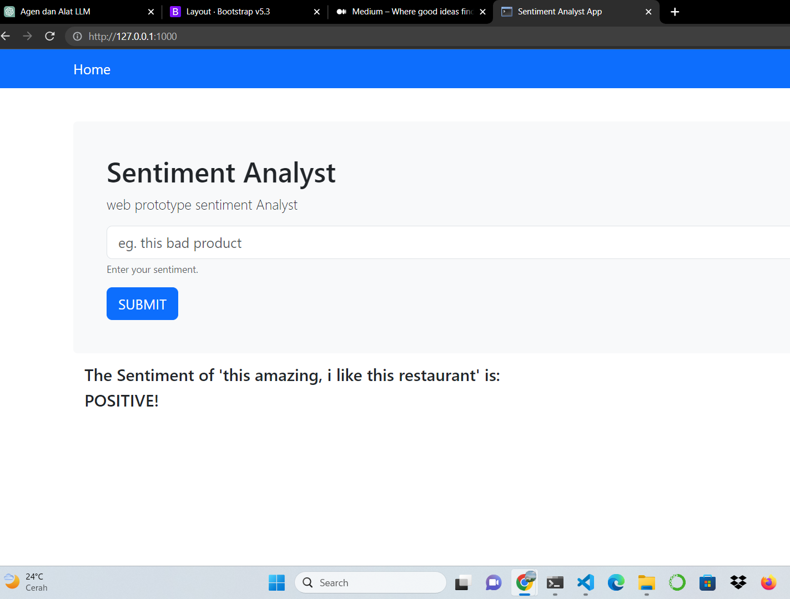

# Project NLP
This sentiment analysis project utilizes Scikit-learn and NLTK libraries. An example project I have worked on involves classifying film genres and restaurant reviews as either positive or negative based on user sentiment.

## Web Sentiment Restaurant reviews

